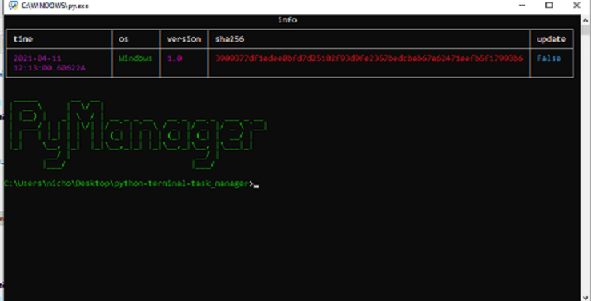

<p align="center">


</p>
<br />
<p align="center">
  <a href="https://github.com/othneildrew/Best-README-Template">
    
  </a>
  
  <h3 align="center">task manager/shell in python</h3>

  <p align="center">
    A simple shell for emulate a few linux command on windows with a cool design
    <br />
    <a href="https://github.com/Nicholas-the-Null/py-manager"><strong>Explore the docs »</strong></a>
    <br />
    <br />
    <a href="https://github.com/Nicholas-the-Null/py-manager/issues">Report Bug</a>
    ·
    <a href="https://github.com/Nicholas-the-Null/py-manager/issues/new?assignees=&labels=&template=feature_request.md&title=">Request Feature</a>
  </p>
</p>
  
<details open="open">
  <summary>Table of Contents</summary>
  <ol>
    <li>
      <a href="#about-the-project">About The Project</a>
      <ul>
        <li><a href="#quotes">quotes</a></li>
      </ul>
    </li>
    <li>
      <a href="#getting-started">Getting Started</a>
      <ul>
        <li><a href="#prerequisites">Prerequisites</a></li>
        <li><a href="#installation">Installation</a></li>
      </ul>
    </li>
    <li><a href="#roadmap">Roadmap</a></li>
    <li><a href="#contributing">Contributing</a></li>
    <li><a href="#feature">new feature status</a></li>

  </ol>
</details>

## About The Project



use your favorite linux commands on windows

### quotes

* [ReadMe template](https://github.com/logicguy1/Discord-Nitro-Generator-and-Checker)


## Getting Started

To get a local copy up and running follow these simple steps.

### Prerequisites
You need to install python, that can be done [here](https://www.python.org)

### Installation
1. Clone the repo
   ```sh
   git clone https://github.com/Nicholas-the-Null/py-manager.git
   ```
2. Install Python packages
   ```sh
   run installer.py
   ```
   


## Roadmap

See the [open issues]("https://github.com/Nicholas-the-Null/py-manager/issues/issues) for a list of proposed features (and known issues).

## Contributing

Contributions are what make the open source community such an amazing place to be learn, inspire, and create. Any contributions you make are **greatly appreciated**.


## feature

name | status | possible release date | idea author | importance
------------ | ------------- | ------------ | ------------- | -------------

cryptography | 50% | 28/04/2021 | author | 5%
screen recorder | 0% | 8/5/2021 | author | 0%

<p>

</p>
